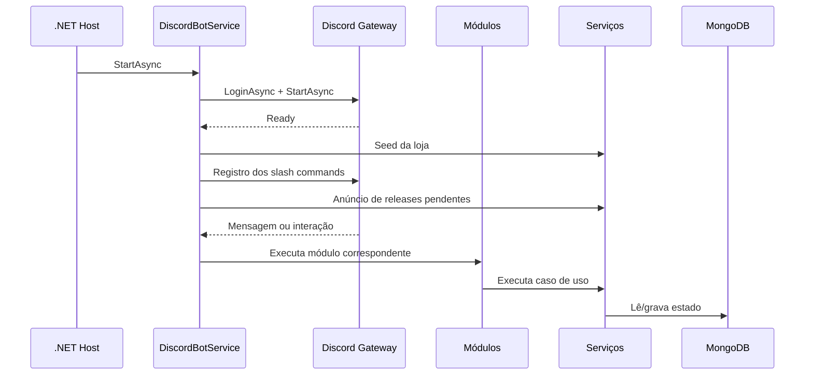

---
tags:
  - arquitetura
  - backend
  - dotnet
atualizado: 2026-09-18
---

# Backend

[[Home|Home]] · [[Arquitetura|← Arquitetura]] · [[Arquitetura/Visão geral|Visão geral]] · [[Arquitetura/Banco de dados|Banco de dados]] · [[Arquitetura/Infraestrutura|Infraestrutura]]

## Bootstrap e composição

`GorillazDiscordBot.Api/Program.cs` é o ponto de entrada. Ele carrega `.env`, cria o host genérico do .NET, registra dependências, garante índices MongoDB e inicia os serviços hospedados.

O contêiner de DI registra como *singletons* o cliente Discord.Net, `CommandService`, `InteractionService`, repositórios, serviços de domínio/aplicação e serviços de sessão. Os `HttpClient`s atendem chat/mídia e o LuckyMonkey.

Os serviços hospedados são:

- `DiscordBotService` — ciclo de vida do Discord e roteamento de eventos.
- `EconomyMaintenanceService` — manutenção econômica diária em UTC.

## Ciclo de vida Discord

`DiscordBotService` conecta o cliente Discord e, no boot, descobre módulos de comandos e de interações por reflexão. Módulos marcados com `[Disabled]` não são registrados.

Em `ReadyAsync`, a loja é semeada quando vazia, comandos slash são registrados e releases pendentes são anunciadas. Com `DISCORD_DEV_GUILD_ID`, o registro é restrito à guild de desenvolvimento; sem ela, os comandos são globais.

O serviço também lida com entrada/saída de membros, alterações de voz e atualizações de guild.

## Fluxo de comandos

### Prefixados

1. `MessageReceived` chama `DiscordBotService.HandleCommandAsync`.
2. O prefixo é resolvido por guild através de `ISettingsRepository<Guild>`; sem configuração, usa `COMMAND_PREFIX`.
3. `CommandService.ExecuteAsync` executa os módulos em `GorillazDiscordBot.Api/Commands`.
4. Em guild, um comando desconhecido é encaminhado a `ChatInteractionService`.

### Slash commands, botões e modais

1. `InteractionCreated` chama `DiscordBotService.HandleInteractionAsync`.
2. `InteractionService.ExecuteCommandAsync` resolve o módulo e usa os serviços injetados.
3. Os módulos respondem por economia, banco, trabalho, crime, cassino, loja, perfil, ensino, veículos, configuração, interações, moderação, releases e ajuda.

## Serviços de aplicação

| Serviço | Responsabilidade |
| --- | --- |
| `ShopService` | Catálogo, compras e inventário; coordena saldo e concorrência por usuário. |
| `PayoutService` | Débitos e créditos de apostas e resultados do cassino. |
| `CasinoApiClient` | Cliente HTTP autenticado do LuckyMonkey. |
| `EconomyAccessor` / `UserAccountService` | Economia compartilhada entre contas vinculadas. |
| `PatrimonioService` | Consolidação de patrimônio. |
| `ReleaseAnnouncementService` | Publicação de releases pendentes nas guilds. |
| `ChatInteractionService` | Respostas configuráveis por guild, incluindo mídia. |
| `VoiceChannelService` | Canais de voz temporários. |
| `GifUrlService` | Normalização de URLs de mídia. |

Serviços de quiz, provas, trabalho, licenças, manobrista e o rastreador de apostas mantêm sessões em memória.

## Domínio

`GorillazDiscordBot.Domain` contém entidades, regras e interfaces de persistência. Principais áreas:

- **Economia:** perfil, regras, transações, conta, itens de loja e inventário.
- **Perfil:** personagem, usuário Discord, guild e membro.
- **Ranking:** tiers e hall da fama.
- **Configuração:** prefixo, boas-vindas e preferências por guild.
- **Conteúdo:** interações de chat e notas de release.

Os contratos como `IEconomyRepository`, `IShopRepository`, `IUserRepository`, `IGuildMemberRepository`, `ICharacterProfileRepository`, `IRankingRepository` e `IReleaseNoteRepository` protegem o domínio dos detalhes do MongoDB.

## Processamento em segundo plano

`EconomyMaintenanceService` calcula a próxima meia-noite UTC, aguarda até ela e chama `IEconomyRepository.ApplyDailyMaintenanceAsync`.

Como as sessões usam estruturas em memória, elas não sobrevivem a reinicializações. O estado persistente é descrito em [[Arquitetura/Banco de dados|Banco de dados]].

## Referências

- `GorillazDiscordBot.Api/Program.cs`
- `GorillazDiscordBot.Api/DiscordBotService.cs`
- `GorillazDiscordBot.Api/Services/EconomyMaintenanceService.cs`
- `GorillazDiscordBot.Api/Commands/`
- `GorillazDiscordBot.Api/Services/`
- `GorillazDiscordBot.Domain/Entity/`
- `GorillazDiscordBot.Domain/Interfaces/`
