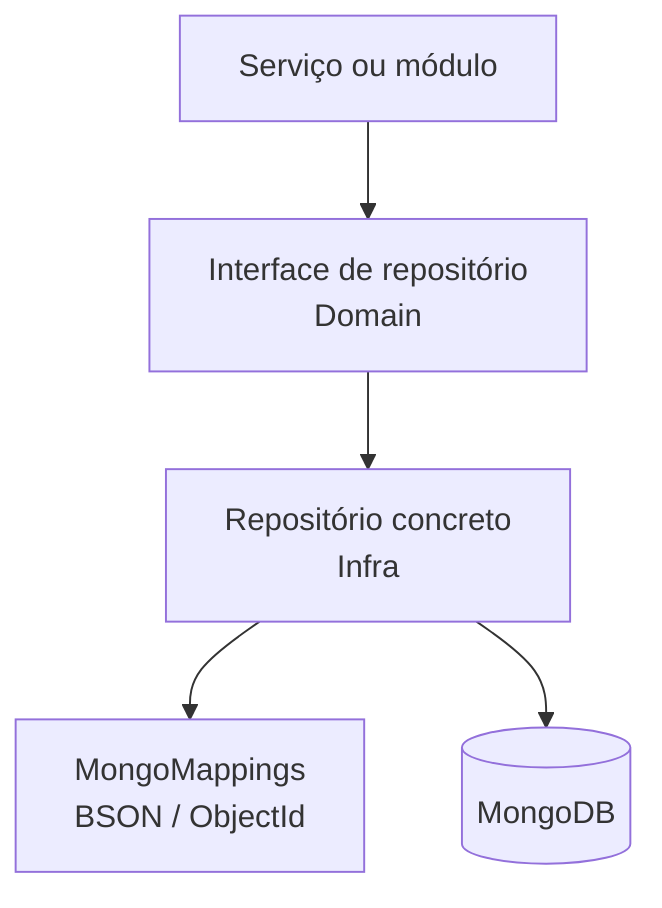

---
tags:
  - arquitetura
  - banco-de-dados
  - mongodb
atualizado: 2026-09-18
---

# Banco de dados

[[Home|Home]] · [[Arquitetura|← Arquitetura]] · [[Arquitetura/Visão geral|Visão geral]] · [[Arquitetura/Backend|Backend]] · [[Arquitetura/Infraestrutura|Infraestrutura]]

A persistência do bot usa **MongoDB**, configurado por `MONGODB_CONNECTION_STRING` e `MONGODB_DATABASE_NAME`. A implementação fica em `GorillazDiscordBot.Infra`; os contratos pertencem ao `GorillazDiscordBot.Domain`.

## Modelo de acesso

- `MongoRepository<T>` oferece a base genérica de persistência.
- `SettingsRepository<T>` mantém um cache concorrente por guild e salva documentos com *upsert*.
- `MongoMappings.Register` centraliza mapeamentos BSON e `ObjectId`.
- A API garante índices no início do processo para as coleções mais utilizadas.

## Repositórios especializados

| Área | Contrato / implementação |
| --- | --- |
| Economia | `IEconomyRepository` / `EconomyRepository` |
| Loja e inventário | `IShopRepository` / `ShopRepository` |
| Usuários | `IUserRepository` / `UserRepository` |
| Membros de guild | `IGuildMemberRepository` / `GuildMemberRepository` |
| Perfil de personagem | `ICharacterProfileRepository` / `CharacterProfileRepository` |
| Ranking | `IRankingRepository` / `RankingRepository` |
| Interações de chat | `IGuildInteractionRepository` / `GuildInteractionRepository` |
| Releases | `IReleaseNoteRepository` / `ReleaseNoteRepository` |
| Configurações de guild | `ISettingsRepository<Guild>` / `SettingsRepository<Guild>` |

## Dados de domínio

| Grupo | Dados principais |
| --- | --- |
| Economia | Perfis econômicos, transações, bancos, regras, itens de loja e inventários. |
| Comunidade | Guilds, membros de guild, usuários e configurações do servidor. |
| Perfil | Personagens e atributos associados ao usuário. |
| Ranking | Tiers, posições e hall da fama. |
| Conteúdo | Interações de chat e notas de release. |

## Índices e inicialização

`Program.cs` chama `EnsureIndexesAsync` no boot para repositórios de membros, usuários, loja, ranking, personagens e releases. Isso reduz a dependência de ações manuais após criar ou atualizar uma instância.

## Estado persistente x efêmero

| Tipo | Onde vive | Sobrevive a reinício? |
| --- | --- | --- |
| Dados de usuário, guild, economia, loja e releases | MongoDB | Sim |
| Cache de configurações de guild | Memória + MongoDB | Recarrega do banco |
| Sessões de quiz, prova, trabalho e manobrista | Memória | Não |
| Rastreamento de apostas de cassino | Memória | Não |

## Operação

Scripts de manutenção e *seed* ficam em `scripts/mongodb/`, incluindo catálogo de loja, releases, ranking e normalizações de guild. Execute-os apenas no ambiente e banco corretos.

## Referências

- `GorillazDiscordBot.Infra/Repository/`
- `GorillazDiscordBot.Infra/Configuration/MongoMappings.cs`
- `GorillazDiscordBot.Domain/Interfaces/`
- `GorillazDiscordBot.Domain/Entity/`
- `scripts/mongodb/`
