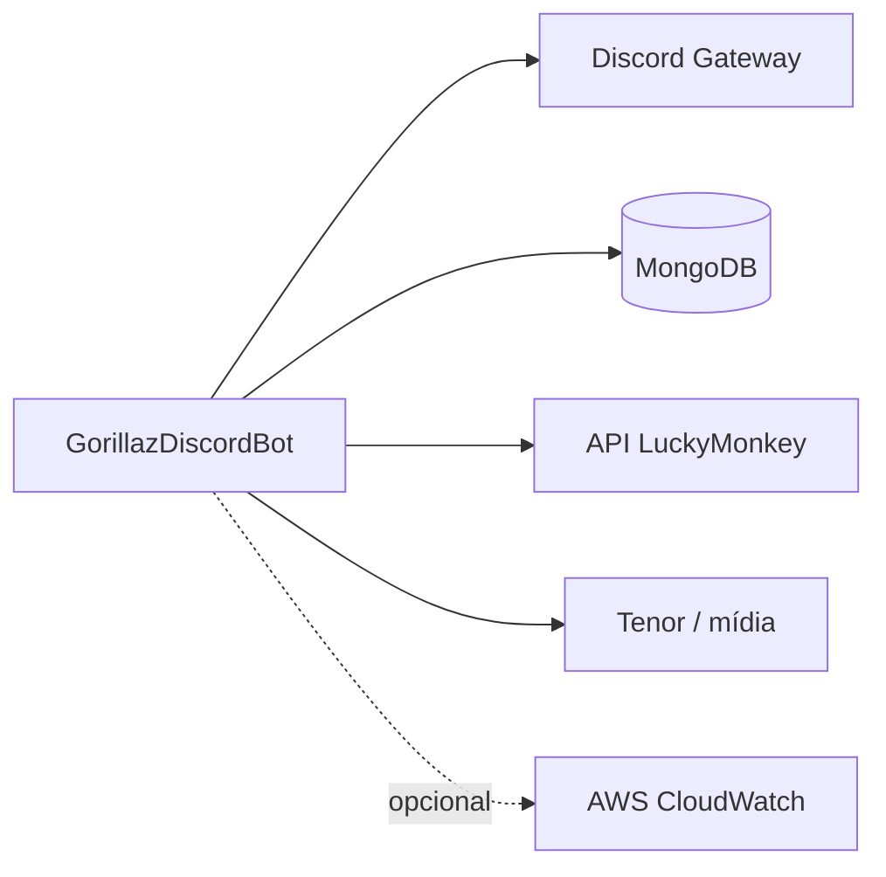

---
tags:
  - arquitetura
  - infraestrutura
  - devops
atualizado: 2026-09-18
---

# Infraestrutura

[[Home|Home]] · [[Arquitetura|← Arquitetura]] · [[Arquitetura/Visão geral|Visão geral]] · [[Arquitetura/Backend|Backend]] · [[Arquitetura/Banco de dados|Banco de dados]]

## Configuração de ambiente

| Variável | Finalidade |
| --- | --- |
| `DISCORD_TOKEN` | Autenticação do bot no Discord. |
| `COMMAND_PREFIX` | Prefixo padrão dos comandos legados; padrão `macaco `. |
| `MONGODB_CONNECTION_STRING` | Conexão com MongoDB. |
| `MONGODB_DATABASE_NAME` | Nome do banco; padrão `gorillazbot`. |
| `DISCORD_DEV_GUILD_ID` | Guild de desenvolvimento para registrar slash commands. |
| `LUCKY_MONKEY_URL` | Base URL do serviço de cassino. |
| `LUCKY_MONKEY_API_KEY` | Chave de API enviada ao LuckyMonkey. |
| `CASINO_JWT_SIGNING_KEY` | Chave de assinatura para JWT do cassino. |
| `AWS_LOG_GROUP` / `AWS_REGION` | Habilita logs no CloudWatch. |

O processo tenta carregar um arquivo `.env` junto ao binário. Segredos devem ficar em variáveis de ambiente, no gerenciador de segredos do ambiente de entrega ou no `.env` local ignorado pelo Git.

## Integrações externas

| Integração | Uso |
| --- | --- |
| Discord.Net | Conexão ao gateway, comandos prefixados, slash commands, botões e modais. |
| MongoDB Driver | Persistência de domínio e configuração. |
| LuckyMonkey | Jogos e sessões de cassino por HTTP, API key e JWT quando configurado. |
| Tenor / mídia | URLs e conteúdo de mídia para interações de chat. |
| AWS CloudWatch | Destino opcional de logs. |

## Containerização e entrega

- `Dockerfile` define a imagem Linux do bot.
- `docker-compose.yml` facilita a execução composta local.
- `.github/workflows/ci.yml` automatiza a integração contínua.
- `.github/workflows/aws.yml` contém o fluxo de entrega na AWS/ECS.
- A pasta `Infra/AWS/ecs/` contém a definição de infraestrutura ECS.
- `task-definition.template.json` inclui a composição de tarefa com o sidecar LuckyMonkey.

## Dependências de execução

- O bot depende do Discord, MongoDB e de um token válido para iniciar funcionalmente.
- Funcionalidades de cassino exigem que o LuckyMonkey esteja acessível e autenticado conforme configurado.
- A propagação de slash commands globais pode levar tempo; use `DISCORD_DEV_GUILD_ID` no ciclo de desenvolvimento.
- A manutenção de economia segue meia-noite UTC.

## Observabilidade e operação

Os logs passam pelo `ILogger` do .NET. Quando `AWS_LOG_GROUP` está configurado, o provedor AWS envia os logs ao CloudWatch. O boot registra falhas de criação de índices como aviso, permitindo que o host continue sendo iniciado.

Consulte [[Arquitetura/Banco de dados|Banco de dados]] para scripts de manutenção e [[Arquitetura/Backend|Backend]] para os serviços hospedados e o estado em memória.

## Referências

- `Dockerfile`
- `docker-compose.yml`
- `.github/workflows/ci.yml`
- `.github/workflows/aws.yml`
- `Infra/AWS/ecs/`
- `task-definition.template.json`
- `GorillazDiscordBot.Api/Program.cs`
