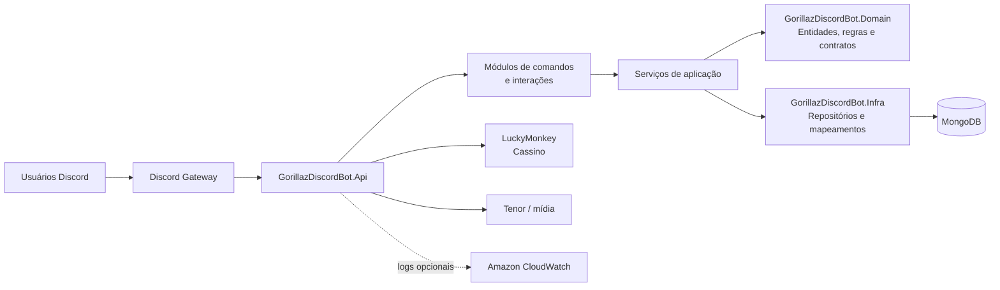
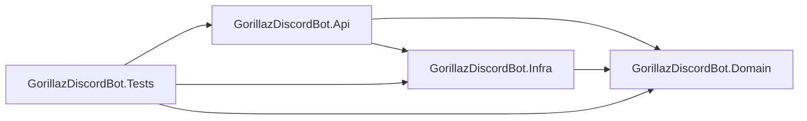

---
tags:
  - arquitetura
  - visao-geral
atualizado: 2026-09-18
---

# Visão geral

[[Home|Home]] · [[Arquitetura|← Arquitetura]] · [[Arquitetura/Backend|Backend]] · [[Arquitetura/Banco de dados|Banco de dados]] · [[Arquitetura/Infraestrutura|Infraestrutura]]

O GorillazDiscordBot é um bot Discord em **.NET 9**. Ele recebe eventos do gateway do Discord, executa módulos de comando e serviços de aplicação, aplica regras de domínio e armazena o estado no MongoDB. Jogos de cassino são delegados ao microserviço LuckyMonkey.

## Projetos

| Projeto | Papel | Dependências diretas |
| --- | --- | --- |
| `GorillazDiscordBot.Api` | Executável, Discord.Net, módulos, serviços e hospedagem. | `Domain`, `Infra` |
| `GorillazDiscordBot.Domain` | Entidades, regras de negócio e interfaces de repositório. | — |
| `GorillazDiscordBot.Infra` | Implementações MongoDB, opções e normalização de mídia. | `Domain` |
| `GorillazDiscordBot.Tests` | Testes de regras, serviços, repositórios, mapeamentos e módulos. | Projetos da solução |

## Responsabilidades por camada

- **API:** adapta eventos e interações do Discord ao backend e compõe as dependências.
- **Domain:** concentra o modelo de negócio e contratos que independem de infraestrutura.
- **Infra:** implementa os contratos de persistência e detalhes do MongoDB.
- **Tests:** valida as regras e comportamentos sem acoplar a suíte ao gateway em execução.

## Navegação

- [[Arquitetura/Backend|Backend]] detalha o caminho da requisição desde o Discord até os serviços.
- [[Arquitetura/Banco de dados|Banco de dados]] descreve como os contratos são persistidos.
- [[Arquitetura/Infraestrutura|Infraestrutura]] reúne operação, ambiente e dependências externas.
