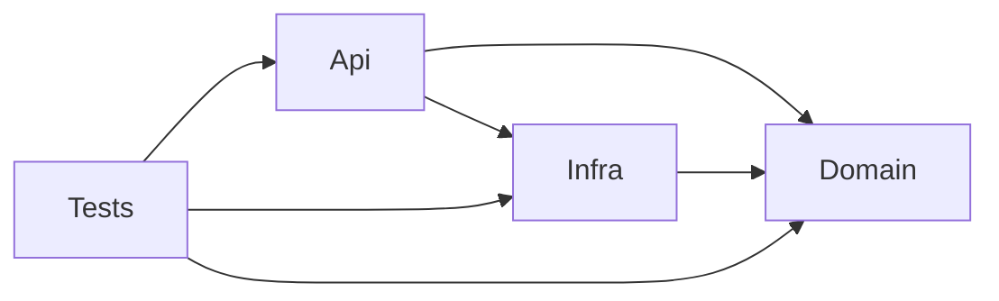

---
tags:
  - moc
  - projetos
atualizado: 2026-09-19
---

# Projetos

Mapa de código por projeto da solução. Cada nota descreve pastas e responsabilidades reais.

[[Home]] · [[Arquitetura/Visão geral|Visão geral]]

## Projetos

- [[Projetos/Api|Api]] — host do bot, comandos, serviços de aplicação e bootstrap.
- [[Projetos/Domain|Domain]] — entidades, regras de negócio e contratos de persistência.
- [[Projetos/Infra|Infra]] — MongoDB, repositórios, serviços externos e Terraform AWS.
- [[Projetos/Tests|Tests]] — suíte xUnit (FluentAssertions + NSubstitute).

## Dependências

